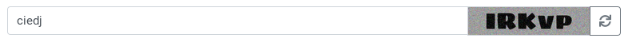

# Captcher

Easy to use classical captcha for Rails apps




## Installation

Add this line to your application's Gemfile:

```ruby

gem 'captcher'

```

And then execute:

```bash

$ bundle

```

Or install it yourself as:

```bash

$ gem install captcher

```

Mount the engine inside your application by adding this line to your application's routes file at `config/routes.rb`:

```ruby

mount Captcher::Engine => "/captcher"

```


## Usage

### Render on page

1. Include the concern with helper methods to your ApplicationController:

```ruby

class ApplicationController < ActionController::Base
  include Captcher::CaptchaAware
end

```

2. Use helper methods in your controller:

```ruby

class MyController < ApplicationController
  def index
    reload_captcha(session) # Reload the captcha
    # render response with success code ...
  end

  def create
    @comment = Comment.new(comment_params)
    captcha_check = confirm_captcha?(session, params[:captcha])
    if @comment.valid? && captcha_check && @comment.save
      # render response with success code ...
    else
      @comment.errors[:captcha] << "Captcha verification failed" unless captcha_check
      # render response with error code ...
    end
  end

  # ... some other code
end

```

3. An example bootstrap-based html/erb code:


```html

<%= simple_form_for(some_form) do |f| %>
  <!-- Some html/erb code for all form fields -->
  <!-- ... -->
  <!-- /Some html/erb code for all form fields -->

  <div class="input-group">
    <%= text_field_tag :captcha, "",
      type: :text,
      label: false,
      class: "form-control",
      placeholder: "Enter the captcha" %>

    <div class="input-group-append">
      <div class="input-group-text" style="padding: 0">
        <%= image_tag(captcher.captcha_path(format: :png), style: "height: 35px;",
                                                           id: "captcha-image") %>
      </div>
      <button class="btn btn-outline-secondary" type="button" id="captcha-reload">
        <i class="fa fa-refresh"></i>
      </button>
    </div>
  </div>

<% end %>

```

4. Javascript code to refresh the capture:


```javascript

function reloadCaptcha() {
  $.ajax({
    type: 'GET',
    url: '/captcher/captcha/reload.png',
    success: function() {
      var timestamp = (new Date()).getTime();
      $('#captcha-image').attr("src", "/captcher/captcha.png?" + timestamp);
    }, 
  });
}

$('#captcha-reload').click(function() {
  reloadCaptcha();
});

```


### API endpoints

These endpoints are available by default (as soon as you've mounted the `Captcher` engine to your `routes.rb` file) and can be used for some async requests:

* `http://your-application.com/captcher/captcha` - Load the captcha image

* `http://your-application.com/captcher/captcha/reload` - Reload the captcha

* `http://your-application.com/captcher/captcha/confirm?confirmation=code` - Confirm captcha code


## Configuration

```ruby

# config/initialiers/captcher.rb

Captcher.configure do |c|
  c.mode = :code_captcha

  c.code_captcha do |cc|
    cc.fonts Dir[Captcher::Engine.root.join("lib/fonts/**")]
    cc.font_size 50
    cc.font_color "black"
    cc.count 5
    cc.background "#999999"
    cc.format "png"
  end
end

```


## TODO

1. Implement some other types of captcha

2. Integrate with Travis to test the gem against different versions of Ruby/ROR

3. Improve code style

4. Improve documentation

5. Autogenerated API documentation


## Contributing

Contribution directions go here.


## Fonts

The fonts wich are shiped by default with this repo
are taken from https://github.com/google/fonts
and use the SIL Open Font License, v1.1

**There's a list of the origin paths of the fonts**:

* https://github.com/google/fonts/tree/master/ofl/bangers

* https://github.com/google/fonts/tree/master/ofl/carterone

* https://github.com/google/fonts/tree/master/ofl/frederickathegreat

* https://github.com/google/fonts/tree/master/ofl/indieflower

* https://github.com/google/fonts/tree/master/ofl/lobstertwo

* https://github.com/google/fonts/tree/master/ofl/sigmarone


## License

The gem is available as open source under the terms of the [MIT License](https://opensource.org/licenses/MIT).
